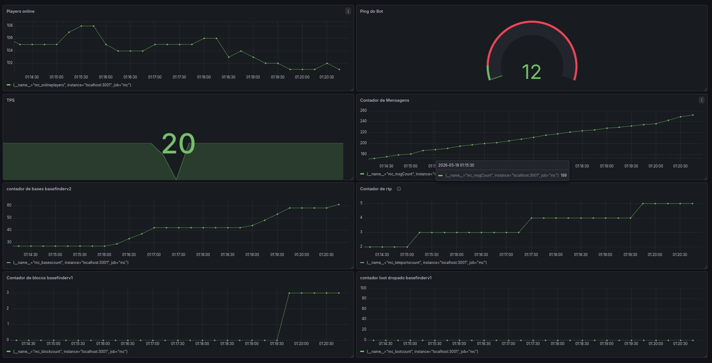

<p align="center">
<br>
Visibot voltou pra coletar dados

</p>

# Contexto
Em Maio de 2024 eu lancei o bot que mudou a comunidade brasileira de Semi Anarquia no Minecraft, chamado de Visibot, ele foi muito usado em um servidor chamado [OnewayCraft](https://discord.gg/A5Fs3n8jbC) , isso inspirou muitos outros a fazer bots também para outros servidores, enfim ele chegou a um fim, já que meu aprendizado nele ja estava maximizado, ele não me rendia nada, nem aprendizado e nem dinheiro, então, cheguei a conclusão de encerrar seus serviços.

### Mas então... Por que voltou?

O motivo da volta dele foi o mesmo de sua nascensa, aprendizado, com um novo servidor maior, eu tive outras ideias de outras coisas pra fazer, dentro dela, coleta de dados em massa. Em maioria ela sera usada para estatísticas, heatmaps (mapa de calor) e dentre outros. Eu fiz ele porque é em Typescript (o que eu não tenho tanta dominância) e também por causa do aprendizado do Grafana e Prometheus. 

# Índice
- [Utilização](#o-que-ele-faz-e-como-usar)
  - [Como usar](#como-usar)
  - [Qual sua utilidade](#pra-que-ele-serve)
- [Configurações adicionais](#configurações-adicionais)
- 🚧 [Integração com interface e estatísticas](#-integracao-com-o-grafana-e-prometheus-)
- [Contribuições](#contribuições)

# O que ele faz e Como usar?
> [!CAUTION] 
> Este bot funciona exclusivamente para o servidor [BawMC](https://discord.gg/WeHHCnJQnT) <br>
> Não tente usar em outros servidores, ele possivelmente não irá funcionar.

## Como usar

> [!WARNING]
> Para utilizar o bot e prosseguir, você antes precisa já ter instalado o [NodeJS](https://nodejs.org) .

Primeiro clone o repositório\
*ou clique em ``Code -> Download ZIP`` e então extraia o arquivo*
```bash
git clone https://github.com/Visivel/Visilog.git
```

Então instale as dependências
```bash
npm install
npm install -D typescript ts-node
npm install -D @types/node
```

Agora renomeie o ``config.yaml.example`` para ``config.yaml`` e configure as seguintes tabelas:
```bash
bot:
  username: "Coloque o nome do bot aqui"
  senha: "Coloque a senha do bot aqui"
```
As outras opcões no arquivo são opcionais.\
O bot automaticamente já se registra, mas em caso de erro, é recomendável você entrar na conta do bot, registrar e logar e somente então ligar o bot.

Para ligar o bot basta executar este comando no terminal na pasta raíz:
```bash
npx tsx src/index.ts
```
## Pra que ele serve?

O propósito deste bot foi coletar dados e armazena-los ou fazer como estatística, dessa forma, escaneando toda área de aproximadamente ~40 mil blocos no raio do spawn

RTP é uma abreviação de Random Teleport, ou seja, teleporte aleatório, chamaremos RTP de Teleport Aleatório, mas sempre relembrando que ele é um comando do servidor.

O bot irá coletar dados voláteis, tais como:
* TPS (Tick Por Segundo)
  > Este número pode variar devido a vários fatores (não so do server)
* Quantidade de Players em tempo real
* Quantidade de mensagens que foi enviada desde que o bot foi ligado
* Ping do bot
* Quantidade de vezes que o bot deu RTP
* Quantidade de bases, lootdrops e blocos especificos encontrados

Ele também coleta dados não voláteis, no qual são mais valiosos e armazena em um ``.csv``:

* Coordenadas de possíveis bases, tipo de modelo de possível base, quando foi coletado, pontuação de possível base e outros.
  > Falsos positivos podem ocorrer devido a estruturas naturais
* Coordenada, id do bloco, quantidade em uma chunk e nome de blocos específicos e quando foi coletado o dado.
* Coordenada de loot dropado no chão, quantidade no chão, nome do loot, se é encantado, quando foi coletado o dado e o id do item.
* Coordenadas de cada localização que o bot foi teleportado e quando esse evento ocorreu.

Os dados não voláteis, mencionados em ordem, serão armazenados nestes caminhos a partir da pasta raíz:

```sh
./src/bot/playeractivity/csvs/bases.csv
./src/bot/playeractivity/csvs/blocks.csv
./src/bot/playeractivity/csvs/loots.csv
./src/bot/playeractivity/csvs/teleports.csv
```

# Configurações adicionais

> Configuração básica do bot, é recomendavel a versão 1.20.1 poís ocorre alguns bugs após ela, no momento, a biblioteca que foi utilizada (*Mineflayer*) demonstra instabilidade acima dessa versão.

```sh
bot:
  username: "Coloque o nome do bot aqui"
  senha: "Coloque a senha do bot aqui"
  versao: '1.20.1'
```

> Estas configurações são mais de gosto próprio, o ``teleportMsg`` irá emitir uma mensagem no console do terminal toda vez que o bot for teleportado, desativado por padrão devido excessiva mensagens. Caso queira ativar, deixe-a como ``true``

> Também, há à ``printMsg`` no qual irá emitir uma mensagem no console do terminal toda vez que um jogador no chat do servidor falar alguma coisa. Caso queira desativa-la, alterne a opção para ``false``.
```bash
config:
  teleportMsg: false
  printMsg: true
```

> Nesta aba você pode configurar quais blocos específicos serão armazenados no caminho ``./src/bot/playeractivity/csvs/blocks.csv`` a partir da pasta raiz, você deve colocar o nome dos blocos seguindo a estrutura de id de blocos, você pode usar [este](https://www.minecraftmaps.com/tools/block-ids) site como exemplo para obter o id de cada bloco que você deseja.
```bash
blockLogger:
  - ender_chest
  - anvil
  - chipped_anvil
  - damaged_anvil
  - trapped_chest
  - shulker_box
  - respawn_anchor
  - lodestone
  - chest
  - barrel
  etc...
```

Esta configuração é bem básica, ela apenas diz se você gostaria de armazenar dados de spawners (estrutura natural do jogo) nas logs do coletor de bases, registrado em ``./src/bot/playeractivity/csvs/bases.csv`` a partir da pasta raíz. Desativado por padrão devido a excessivas logs, caso queira ativar, alterne a opção para ``true``
```bash
basefinder:
  logSpawner: false
```

# Contribuições

Sinta-se livre para contribuir, seja abrindo uma [issue](https://github.com/Visivel/Visilog/issues) caso encontre uma falha ou queira sugerir alguma adição ou caso queira contribuir corrigindo falhas ou implementando novas adições pelos [Pull Requests](https://github.com/Visivel/Visilog/pulls).

# 🚧 EM DESEVOLVIMENTO 🚧
##  Integracao com o Grafana e Prometheus 

```bash
grafanaConfig:
  expressPort: 3001
```

<p align="center">

</p>


